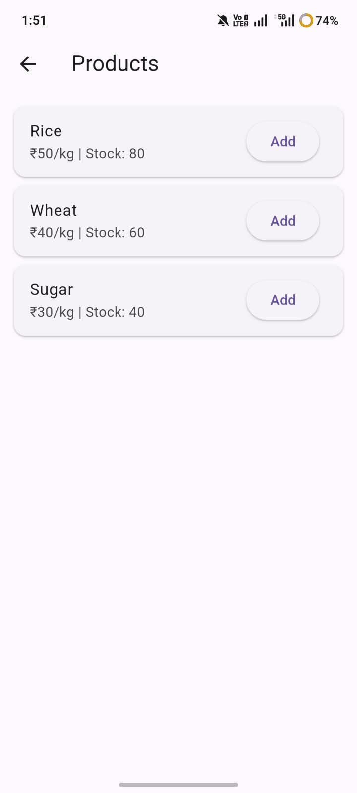
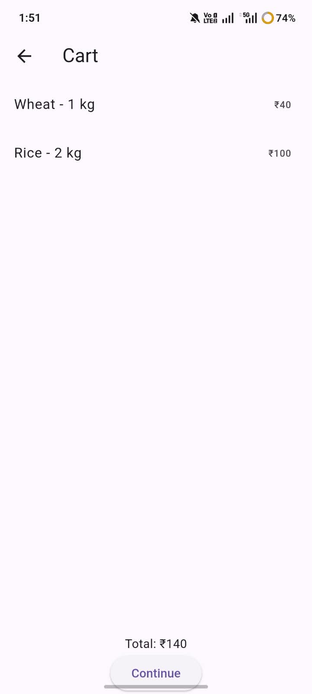

#  🛒 Smart Ration Management System

## About the Project

Smart Ration Management System is a Flutter-based mobile application designed to simplify ration shopping through digital booking, slot selection, billing, and queue tracking.


## 🔗 Project Links

- **GitHub Repository:** [Smart Ration Management System](https://github.com/suruthi-1/Smart-Ration-Management-System)


## Features

- User Login Interface
- Ration Product Listing
- Shopping Cart
- AI-Inspired Crowd Prediction
- Time Slot Selection
- UPI and Cash Payment Selection
- Digital Bill Generation
- Token Generation
- Simulated Live Queue Tracking
- Purchase History

## Technologies Used

- Flutter
- Dart
- Material Design

## Modules

1. Login
2. Dashboard
3. Product Selection
4. Cart Management
5. Slot Booking
6. Payment
7. Digital Billing
8. Queue Tracking
9. Purchase History

## Getting Started

### Prerequisites

- Flutter SDK
- Dart SDK
- Android Studio or Visual Studio Code

### Installation

1. Clone the repository:

   ```bash
   git clone https://github.com/suruthi-1/Smart-Ration-Management-System.git
   ```

2. Navigate to the project directory:

   ```bash
   cd Smart-Ration-Management-System
   ```

3. Install dependencies:

   ```bash
   flutter pub get
   ```

4. Run the application:

   ```bash
   flutter run
   ```

## Future Enhancements

- Real-time database integration
- Actual crowd prediction using historical data
- Secure user authentication
- Payment gateway integration
- Live queue updates

## Project Type

Academic / Student Project developed through teamwork.

## Project Team

- **Repository Owner:** [Suruthi D](https://github.com/suruthi-1)
- **Contributor:** [Sandana P M](https://github.com/SandanaPM)
- **Contributor:** [Sanjay C](https://github.com/sanjayc-16)

---

**Smart Ration Management System Team**

⭐ If you find this project useful, consider giving it a star!

---

## 📱 Application Screenshots

### 1. Login Page


### 2. Dashboard


### 3. Products


### 4. Product Selection


### 5. Shopping Cart


### 6. Slot Selection


### 7. Mode of Payment


### 8. Digital Bill


### 9. Confirmation Page


### 10. Live Queue Tracking


### 11. Purchase History

